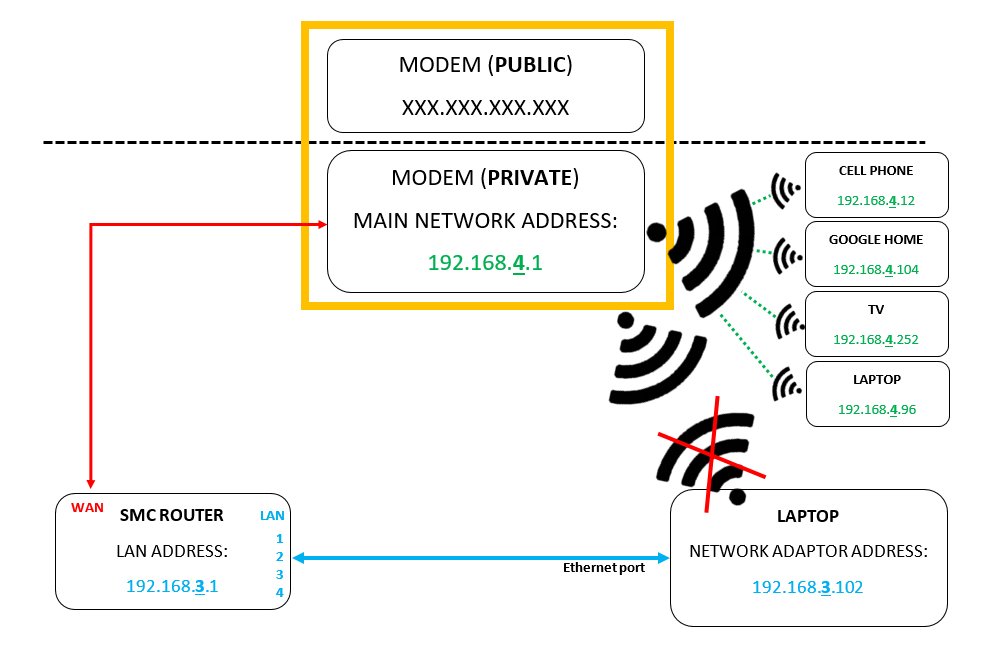

## How to Configure a Separate Subnet on a Router

This tutorial was designed with the intent of educating absolute beginners on internet/network connectivity with no previous background in IT. Hopefully by the end of this exercise you will have a better understanding of how your personal device talks to other devices using the internet.

To understand network connectivity better, we will be configuring a separate subnet on a router to connect your computer to, separate from the other devices on the main network address. The goal of this exercise is illustrated in the diagram below.

The router will receive incoming signals from the WAN port (‘Public’ internet), assign itself a main network IP address using DHCP, and then reroute the connection to your laptop under a different subnet, separate from the main network.

